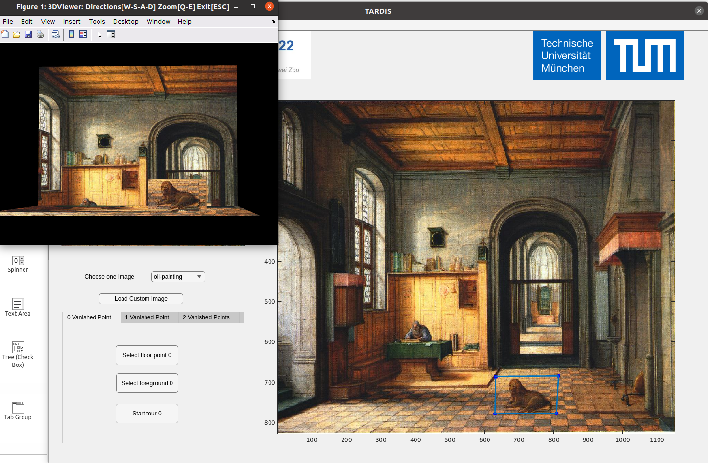
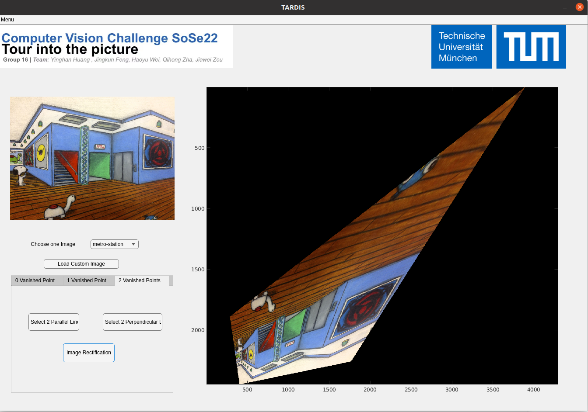

# Computer Vision Summersemester 2022 Challenge
# Tour into Picture
//## Group 16: 
//Yinghan Huang: GUI and APP design, 3 cases of vanishing point 

//Jingkun Feng: 3D reconstruction, homography Matrix calculation,Visual performance Optimization 

//Hauyu Wei, Jiawei Zou :Foreground selection and Interpolation

//Qihong Zha: Interpolation and Poster

## Introduction
This application can create and visualize different perspective of a room based
on a single image. It can provides funktionality for the user to choose an image, 
select the vanishing point as well as select foreground objects. At the end, 
it will create a 3D tour, where the user can walk through and observe different 
corners of the reconstructed room by pressing a few buttons.

## Dependencies
To run the application, you need to install the following Mathworks Toolboxes:
- Image Processing Toolbox
- Computer Vision Toolbox
- Symbolic Math Toolbox

## Quick Retart

### 1 vanishing point case

1. Open Matlab and change the current folder to the project directories.
2. Run the file `main.m` in Command Window.
3. Choose an image by scolling down the selection list next to 'Choose one Image'.
   You can also choose images in other directories by clicking `Load Custom Image`.
4. Choose different mode by clicking tha tabs `0 Vanishing Point`, 
   `1 Vanishing Point` or `2 Vanishing Points`.
5. To select rear wall and to define a vanishing point of the scene, 
   first click on `Select Vanishing Point and Background`, then drag the
   points and sides of the rectangle shown on the right
6. (Optional) To select foreground objects, click on `Select foreground`. After
   that, you can extract the object by clicking the left mouse button to define 
   its vertexes. Press the right mouse button to complete 
   the extraction. Please select objects one after one. Note that our application
   only supports reconstructing foreground objects which are "on the floor".
   If you want to cancel the selected points and re-select, press the space button.
   If you are using Linux system, in case you pressed space but the application does
   not respond, click on the window bar to activate the window, and try to press
   space again.
7. To start the amazing tour into the picture, click 'Start Tour'.
   Note that the computing time depends on the resolution of the images and 
   also depends on whether and how many foreground objects are selected.
8. The reconstructed 3D scene will be display in a new window. You can move
   the camera, rotate it and zoom by pressing some keys (See detailed
   instruction shown in the window).

### 0 Vanished Point Case

Based on the thesis, when there is no obvious vanished point in the picture, we just keep the "floor wall" and "rear wall"  from the picture according to the imaginary vanished point.

1. Choose or load images and click on tab "0 Vanished point", so that the image will be in axis (!!)
2. Click the "Select Vanished Point and Background 0" to select the floor and rear wall in the right image axis
3. Click the "Select Foreground 0" to select the object in a closer distance, only choose one object per click!! and right click the finish the selecting. If you want to select more than one object, just click the "Select Foreground 0" one more time
4. Click the start tour to begin the journey

### 2 Vanished Point Case

Unlike the above 2 cases, we just discuss about how to do image rectification here. Because when we "cancel" one of the vanished point, the shape will not be in shape of rectangle. So a tour will be weird. 

1. Choose or load images and click on tab "2 Vanished point"

2. first select 2 pairs of parallel lines to do the affine rectification, also draw the vanishing line. 

   ​	it is recommended that choose the parallel lines whose intersection far away from the picture itself, otherwise the image after affine rectification will not be in the axis

3. In the image after affine rectification, choose two perpendicular lines that you want to keep them perpendicular after metric rectification

4. click on image rectification to see the effect.

## GUI (early version)
In our working progress, we've tried earlier the user interaction via Matlab GUI.
This version provides more or less the same function as the application version,
except that it cannot handle scenes with 0 or 2 vanishing points.
You can find this version in the folder `archiv`. Please feel free to try it.

## Failed Cases
There are some interesting functions that we wnat to implement but didn't succeed.
Those matlab functions are stored in the folder `failed_issues`. Please check it out, if you have time.

## References
[1] Y. Horry, K.-I. Anjyo, and K. Arai, “Tour into the picture: using a spidery mesh interface to make animation from a single image,” in Proceedings of the 24th annual conference on Computer graphics and interactive techniques, 1997, pp. 225–232.
[2] K. Andersen, The geometry of an art: the history of the mathematical theory of perspective from Alberti to Monge. Springer Science & Business Media, 2008. 5
[3] A. Criminisi, P. Perez and K. Toyama, "Object removal by exemplar-based inpainting," 2003 IEEE Computer Society Conference on Computer Vision and Pattern Recognition, 2003. Proceedings., 2003, pp. II-II, doi: 10.1109/CVPR.2003.1211538.

